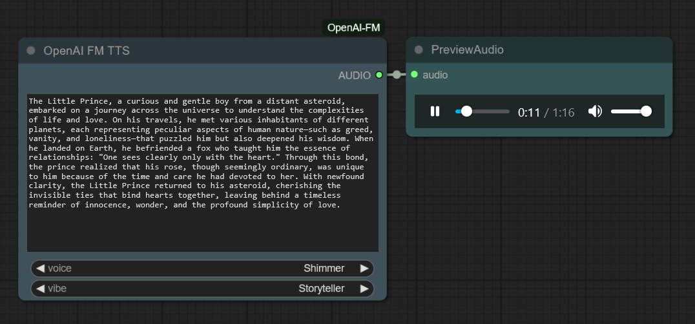

# ComfyUI Node for OpenAI FM Text-to-Speech

<div align="center">
  
</div>

**Description:**

The `OpenAI FM TTS` node is a custom node for ComfyUI that seamlessly integrates the [OpenAI FM Text-to-Speech](https://www.openai.fm/) service into your audio workflows. This node allows you to easily convert text to speech with a variety of voices and emotional styles directly within ComfyUI. Enhance your projects by adding realistic and expressive voiceovers, creating dynamic audio content, or experimenting with different vocal performances.

**Features:**

-   **Text-to-speech Conversion:** Leverages the OpenAI FM API to convert input text into high-quality speech.
-   **Voice Selection:** Offers a dropdown menu populated from `data/voices.json`, allowing you to choose from a variety of available voices.
-   **Vibe Control:** Incorporates emotional styles using `data/vibes.json`, enabling you to generate speech with different emotional tones to match the context of your project.
-   **Seed Parameter:** Includes a 'seed' input for reproducible audio generation. Using the same seed ensures consistent output for the same input text, voice, and vibe. Setting seed to `0` will use a random seed.
-   **ComfyUI AUDIO Output:**  Outputs an `AUDIO` signal that is directly compatible with ComfyUI's audio processing pipeline.
-   **Audio File Saving:** Automatically saves generated audio files to the `output` directory for easy access and later use.

**Installation:**

1.  **Clone the repository:** Open your ComfyUI `custom_nodes` directory and clone this repository:
    ```bash
    cd ComfyUI/custom_nodes
    git clone https://github.com/fairy-root/ComfyUI-OpenAI-FM.git
    ```

2.  **Install dependencies:** Navigate to the cloned directory and install the required Python libraries using pip. Choose the appropriate command based on your ComfyUI environment:

    a. **Standard ComfyUI Python:** If using the standard ComfyUI Python environment:
    ```bash
    cd ComfyUI/custom_nodes/ComfyUI-OpenAI-FM
    pip install -r requirements.txt
    ```

    b. **Embedded ComfyUI Python:** If using embedded Python (common in portable ComfyUI installs):
    ```bash
    cd ComfyUI/custom_nodes/ComfyUI-OpenAI-FM
    ..\..\..\python_embeded\python.exe -m pip install -r requirements.txt
    ```
    Ensure that `torch` and `torchaudio` are installed, as they are listed in `requirements.txt`.

3.  **Restart ComfyUI:** After installation, restart ComfyUI to ensure the node is loaded. You can then find the `OpenAI FM TTS` node in the `audio` category within ComfyUI.

**Usage:**

1.  **Add the Node:** In your ComfyUI workflow, right-click, go to `audio`, and select `OpenAI FM TTS`.
2.  **Input Text:** Enter the text you wish to convert to speech in the "text" input field. Multiline text is fully supported for longer dialogues or scripts.
3.  **Seed:**  To ensure consistent audio output for the same settings, set an integer value for the 'seed' parameter. Setting it to `0` will result in a randomly generated seed for each audio generation, providing variation.
4.  **Select Voice:** Use the "voice" dropdown to select a voice for the TTS conversion. The list of voices is loaded from the `data/voices.json` file.
5.  **Select Vibe:** Choose an emotional style from the "vibe" dropdown menu. Vibes are configured in `data/vibes.json` and allow you to modify the emotional tone of the generated voice.
6.  **Output:** The node outputs an `AUDIO` signal. Connect this to other audio nodes for further processing or to a Save Audio node to save the generated speech to a file.

**Configuration Files:**

-   **`data/voices.json`:** This JSON file contains a list of available voices that are loaded into the "voice" dropdown menu when ComfyUI starts. You can customize or extend the voice options by modifying this file.
-   **`data/vibes.json`:**  This file configures the "vibe" dropdown menu and defines the emotional styles that can be applied to the voices. Each vibe setting can adjust various aspects of the voice to achieve different emotional tones.

**Dependencies:**

-   `requests` (for making API calls)
-   `torch` and `torchaudio` (for audio processing and tensor operations)
    *(All dependencies are listed in `requirements.txt` for easy installation)*

**Expected Output:**

-   **ComfyUI AUDIO Output:** The node produces an `AUDIO` output signal, which can be directly connected to other ComfyUI audio processing nodes or a Save Audio node. The audio is a tensor in ComfyUI format: `[batch, channels, samples]` with a sample rate of 44100Hz.
-   **Saved Audio Files:** Generated audio files are automatically saved. By default, they are saved in `ComfyUI/custom_nodes/ComfyUI-OpenAI-FM/output/`. If this directory is not writable, the script will attempt to save to `ComfyUI/output/` or the script directory itself. Filenames are prefixed with `openaifm_` and include a timestamp for easy identification. The audio files are saved in WAV format.

## Legal Disclaimer

This project is intended for educational and personal use only. It is not affiliated with, endorsed by, or officially supported by OpenAI. Use of the OpenAI FM API is subject to their terms of service. Reverse engineering was employed to understand the API for the purpose of creating this tool. Please ensure your usage complies with all applicable terms and legal standards.

---

## Donation

Your support is appreciated:

- **USDt (TRC20)**: `TGCVbSSJbwL5nyXqMuKY839LJ5q5ygn2uS`
- **BTC**: `13GS1ixn2uQAmFQkte6qA5p1MQtMXre6MT`
- **ETH (ERC20)**: `0xdbc7a7dafbb333773a5866ccf7a74da15ee654cc`
- **LTC**: `Ldb6SDxUMEdYQQfRhSA3zi4dCUtfUdsPou`

## Author and Contact

- **GitHub**: [FairyRoot](https://github.com/fairy-root)
- **Telegram**: [@FairyRoot](https://t.me/FairyRoot)

## License

This project is licensed under the MIT License. See the [LICENSE](LICENSE) file for details.

## Contributing

Contributions are welcome! Please open an issue or submit a pull request for any improvements or features.
